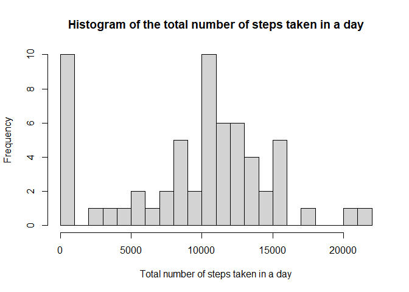
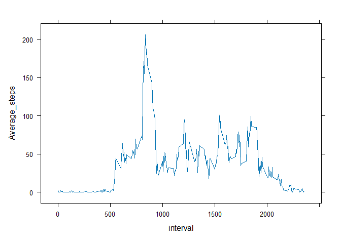
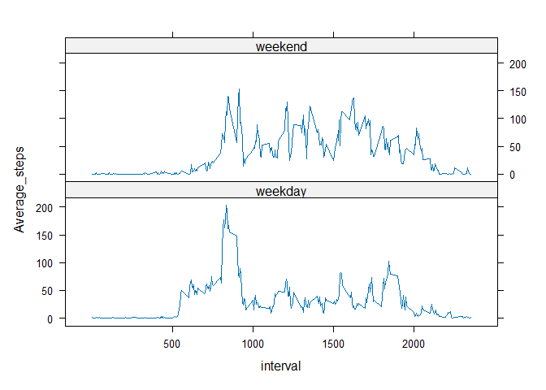

## Set the environment before data processing

```r
library(tidyverse)
library(lattice)
local <- Sys.getlocale("LC_TIME")
Sys.setlocale("LC_ALL", "English") 
```


## Loading and processing data from the zipped file

```r
con <- unz("activity.zip", "activity.csv")
ori_df <- read.csv(con)
df <- ori_df
```


## What is mean total number of steps taken per day?
**Histogram of the total number of steps taken each day**

```r
df$date <- ymd(df$date)
p <- df %>% group_by(date) %>% summarise(Total_steps=sum(steps, na.rm = T))
hist(p$Total_steps, breaks = 20, xlab="Total number of steps taken in a day", 
     main = "Histogram of the total number of steps taken in a day")
```

<!-- -->

```r
s_mean= mean(p$Total_steps)
s_median= median(p$Total_steps)
```
**Results**  
The mean total number of steps taken per day is 9354.2295082 steps   
The median total number of steps taken per day is 10395 steps  

## What is the average daily activity pattern?
**In 5-minute interval**  

```r
df$interval <- as.numeric(df$interval)
p <- df %>% group_by(interval) %>% summarise(Average_steps= mean(steps, na.rm =TRUE))

#or use ggplot(p, aes(x=interval, y=Average_steps))+ geom_line()
xyplot(Average_steps~interval, data = p, type="l")
```

<!-- -->

**Which 5-minute interval, on average across all the days in the dataset, contains the maximum number of steps?**  

```r
x <- p[which(p$Average_steps== max(p$Average_steps)),]
# or just use x <- p[which.max(p$Average_steps),]
x
```

```
## # A tibble: 1 x 2
##   interval Average_steps
##      <dbl>         <dbl>
## 1      835          206.
```
**Result:**  
The 835 interval contains the maximum number 206.1698113 of steps.

## Imputing missing values
**Calculate and report the total number of missing values in the dataset (i.e. the total number of rows with NAs)**  

```r
total_NA <- sum(is.na(df))
```
**Results:**  
The total number of NAs in the dataset is 2304

**Use the mean steps for that day to fill in all of the missing values in the dataset.**  


```r
df2 <- df %>% group_by(date) %>% summarise(day_mean=mean(steps, na.rm = TRUE))
df2$date <- ymd(df2$date)
df2 <- left_join(df, df2, by="date")

for (i in 1:nrow(df2)){
        if (is.na(df2$steps[i]))  {
                if (is.na(df2$day_mean[i])){
                        df2$steps[i] <- 0
                }else {
                        df2$steps[i] <- df2$day_mean[i]
                }
        }else{
                next
        }
}

new_df <- ori_df
new_df$steps <- df2$steps
# this new_df is the same as the original dataset except the Nas are filled
new_df$date <- ymd(new_df$date)
p <- new_df %>% group_by(date) %>% summarise(Total_steps=sum(steps, na.rm = T))
hist(p$Total_steps, breaks = 20, xlab="Total number of steps taken in a day", 
     main = "Histogram of the total number of steps taken in a day")
```

<!-- -->

```r
s_mean= mean(p$Total_steps)
s_median= median(p$Total_steps)
s_mean
```

```
## [1] 9354.23
```

```r
s_median
```

```
## [1] 10395
```
**Results:**  
1. The new dataframe I make is called new_df. It's the same as the original dataset except the NAs in column steps are filled  
2. The calculated mean for the new dataset is 9354.2295082  
The calculated median for the new dataset is 1.0395\times 10^{4}    
3. The way I used to fill the missing value by either the mean steps of the day or 0 if the value of the whole day is missing, basically produces the same result as the original dataset.  

## Are there differences in activity patterns between weekdays and weekends?


```r
#Make the weekend/weekday indicator (factor)
df$steps <- new_df$steps
df <- df %>% mutate (week_day= ifelse(wday(date)== 7| wday(date)==1, "weekend", "weekday"))
df$week_day <- factor(df$week_day, levels=c("weekday", "weekend"))


#Comparing weekends and weekdays on the average of steps with 5-minute interval
p <- df %>% group_by(interval, week_day) %>% summarise(Average_steps= mean(steps))
```

```
## `summarise()` has grouped output by 'interval'. You can override using the
## `.groups` argument.
```

```r
#if use ggplot
# ggplot(p, aes(x=interval, y=Average_steps))+ geom_line()+ facet_grid(week_day~.)

xyplot(Average_steps~interval|week_day, data=p, type='l', layout=c(1, 2),
       scales=list(x=list(at=c(0500, 1000, 1500, 2000), labels=c(500, 1000, 1500, 2000))))
```

<!-- -->
  
**Results:**  
There is greater variation of activities (steps) in weekdays than on weekends, with
the highest average total steps in a 5-minute interval happened in the morning of weekdays around interval 800-900.  


## Set the environment back

```r
Sys.setlocale(locale=local)
```
